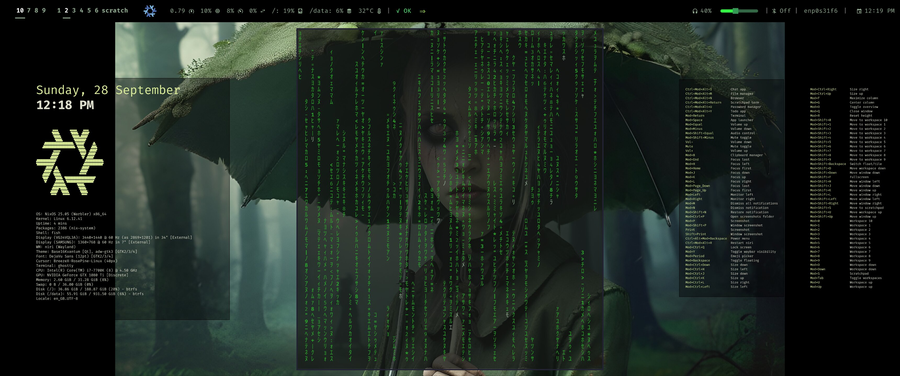

    

 

    
    

    <i><u>dotfiles for NixOS, macOS, and Home-Manager</u></i>

## About

My personal NixOS, macOS, and Home-Manager configuration using a dual-repository setup. See the template for the private repository layout at [GitHub](https://github.com/leahevy/nix-dotfiles-config-template).

    

## Features

- Platform-independent configuration with platform-specific modules for NixOS, macOS, and Home-Manager.
- Personal configuration flake acts as the root flake, pulling in this repository as a library input.
- Various local flake inputs for clear separation included in a custom module system.
- Very modular approach that allows activating configurations per profile.
- Custom module format following the dendritic pattern with `on.*` event functions for context-specific NixOS/Home-Manager configuration.
- Script and flake output to create a bootable ISO which contains the `nxcore` and personal `nxconfig` directory on the live
  disk.
- Bootstrap scripts to initially setup a new system, either standalone (home-manager) or NixOS.
- Sops-Nix is used for secrets management.
- Impermanence configurations are distributed across modules, with each module defining the files it needs to persist.

## Manual Bootstrap

1. Install Nix: <https://nixos.org/download/>
2. Run `mkdir -p ~/.config/nx && git clone https://github.com/leahevy/nix-dotfiles ~/.config/nx/nxcore`
3. Run `git clone https://github.com/leahevy/nix-dotfiles-config-template.git ~/.config/nx/nxconfig`
4. Edit `~/.config/nx/nxconfig/.sops.yaml` with your keys.
5. Create encrypted secrets in `~/.config/nx/nxconfig/secrets/`
6. Add profiles in `~/.config/nx/nxconfig/profiles/` - examples can be found in templates/*
7. Run `~/.config/nx/nxconfig/updatekeys.sh`
8. Run `cd ~/.config/nx/nxcore && ./nx sync`
9. Commandline utility should be installed as `nx`, try `nx help`

## Config directory

### Required secrets

`~/.config/nx/nxconfig/secrets/global-secrets.yaml`:

        github_token: access-tokens = github.com=<Token used to avoid rate limiting and used for private repositories>

`~/.config/nx/nxconfig/secrets/user-secrets.yaml`:

        userPasswordHash: <Password hash used for the mainUser user on a NixOS host>

## ISO Build Requirements

For building live ISOs, `configRepoURL` must be set in `~/.config/nx/nxconfig/variables.nix`.
installed system during the live ISO installation process.

## NX Utility

The configuration is managed with the provided `nx` utility. To see all available commands, run:

        nx --help

All commands are also described programmatically in the file: `scripts/utils/deployment.nix`.
