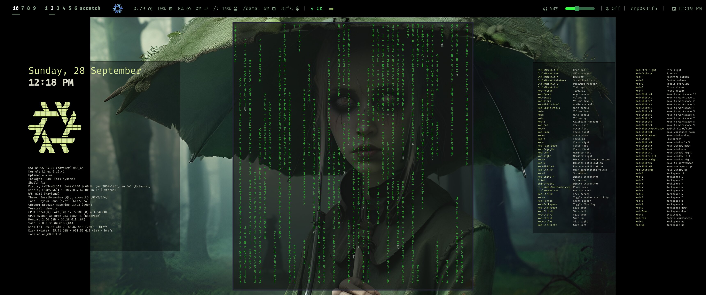

    

 

    
    

    <i><u>dotfiles for NixOS and Home-Manager</u></i>

## About

My personal NixOS and Home-Manager configuration using a dual-repository setup. See the template for the private repository layout in `src/nxconfig/`.

    

## Features

- Platform-independent configuration with platform-specific modules for NixOS and Home-Manager.
- Personal configuration flake which is not part of the main repository and is injected in all builds.
- Various local flake inputs for clear separation included in a custom module system.
- Very modular approach that allows activating configurations per profile.
- Custom module format designed for this flake. The `configuration` function inside modules uses standard NixOS/Home-Manager syntax and can be adapted for other flakes.
- Script and flake output to create a bootable ISO which contains the `nxcore` and personal `nxconfig` directory on the live
  disk.
- Bootstrap scripts to initially setup a new system, either standalone (home-manager) or NixOS.
- Sops-Nix is used for secrets management.
- Impermanence configurations are distributed across modules, with each module defining the files it needs to persist.

## Manual Bootstrap

1. Install Nix: <https://nixos.org/download/>
2. Run `mkdir -p ~/.config/nx && git clone https://github.com/leahevy/nix-dotfiles ~/.config/nx/nxcore`
3. Run `cp -r ~/.config/nx/nxcore/src/nxconfig ~/.config/nx/nxconfig`
4. Edit `~/.config/nx/nxconfig/.sops.yaml` with your keys.
5. Create encrypted secrets in `~/.config/nx/nxconfig/secrets/`
6. Add profiles in `~/.config/nx/nxconfig/profiles/` - examples can be found in templates/*
7. Run `~/.config/nx/nxconfig/updatekeys.sh`
8. Run `cd ~/.config/nx/nxcore && ./nx sync`
9. Commandline utility should be installed as `nx`, try `nx help`

## Config directory

### Required secrets

`~/.config/nx/nxconfig/secrets/global-secrets.yaml`:

        github_token: access-tokens = github.com=<Token used to avoid rate limiting and used for private repositories>

`~/.config/nx/nxconfig/secrets/user-secrets.yaml`:

        userPasswordHash: <Password hash used for the mainUser user on a NixOS host>

## ISO Build Requirements

For building live ISOs, `configRepoIsoUrl` must be set in `~/.config/nx/nxconfig/variables.nix`.
Optionally, set `configRepoInstallUrl` and `coreRepoInstallUrl` variables to set different URLs for the
installed system during the live ISO installation process.

## NX Utility

### Configuration:

- `nx profile <$1>`: Configures to use profile <$1>. To revert it remove the file .nx-profile.conf in the nxcore directory.

### Switch Commands:

- `nx sync`: Sync/deploys the system state.
- `nx build`: Test build configuration without deploying.
- `nx gc`: Run the garbage collection.
- `nx update`: Updates the flake in git (without switching).
- `nx dist-upgrade <version>`: Bump NixOS version.
- `nx brew`: Sync Homebrew packages (Darwin only).

### NixOS Only:

- `nx dry`: Tests the configuration without deploying it.
- `nx test`: Activates the system state without adding it to the bootloader menu.
- `nx boot`: Add the configuration to the bootloader without switching right yet.
- `nx rollback`: Rollback to the previous configuration.
- `nx impermanence`: Manage ephemeral root filesystems.

### Evaluation:

- `nx eval <path>`: Evaluate a flake path with config override.
- `nx package <pkg>`: Get store path for package(s). Use `--unstable` for nixpkgs-unstable.
- `nx version`: Show the current NixOS version.

### Home-Manager only:

- `nx news`: Shows recent news.

### Folder Commands:

- `nx config`: Open a shell in the config directory.
- `nx core`: Open a shell in the core directory.
- `nx format`: Formats directories with treefmt.
- `nx exec`: Runs any command in the core directory.

### Git Commands:

- `nx log`: Runs the git log command.
- `nx head`: Runs the git show HEAD command.
- `nx diff`: Runs the git diff command.
- `nx diffc`: Runs the git diff command with --cached.
- `nx status`: Runs the git status command.
- `nx commit`: Runs the git commit command.
- `nx pull`: Runs the git pull command.
- `nx push`: Runs the git push command.
- `nx add`: Runs the git add command.
- `nx addp`: Runs the git add command with --patch.
- `nx stash`: Runs the git stash command.
- `nx switch-branch`: Switches the git branch.
